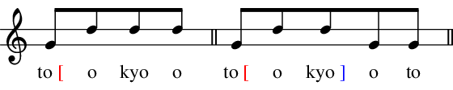
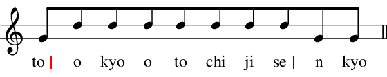
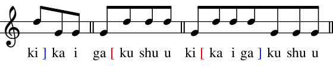

<p align="center"></p>


# Tokyo Dialect MELOdic accent DICtionary (tdmelodic) generator

This module generates a large scale accent dictionary of
Japanese (Tokyo dialect) using a neural network based technique.

For academic use, please cite the following paper. [[IEEEXplore]](https://ieeexplore.ieee.org/document/9054081)
```bibtex
@inproceedings{tachibana2020icassp,
    author    = "H. Tachibana and Y. Katayama",
    title     = "Accent Estimation of {Japanese} Words from Their Surfaces and Romanizations
                 for Building Large Vocabulary Accent Dictionaries",
    booktitle = {2020 IEEE International Conference on Acoustics, Speech and Signal Processing (ICASSP)},
    pages     = "8059--8063",
    year      = "2020",
    doi       = "10.1109/ICASSP40776.2020.9054081"
}
```

## Background: Japanese Pitch Accent
Japanese language is a pitch accent language.
In contemporary Tokyo dialect, there are two kinds of events that invoke the change of pitch.

- `[`: _raise the pitch here_
- `]`: _lower the pitch here_

Accent is important in spoken Japanese language.
See following examples.

Some words have the same romanization but have different accents. For example,

- _fuji_
    - 富士 (Mt. Fuji) is pronounced as `fu ] ji`.
    - 藤 (wisteria) is pronounced as `fu [ ji`.
- _sake_
    - 鮭 (salmon) is pronounced as `sa ] ke`.
    - 酒 (alcoholic beverage) is pronounced as `sa [ ke`
- _hashi_
    - 端 (edge, corner) is pronounced as `ha [ shi`.
    - 橋 (bridge) is pronounced as `ha [ shi ]`.
    - 箸 (chopstics) is pronounced as `ha ] shi`.

The accents of compound words are a little complicated. For example,

| word | accent |
| --- | --- |
| 東京`to[okyoo`, 東京都`to[okyo]oto` |  |
| 東京都知事`to[okyootochi]ji` |  |
| 東京都知事選挙`to[okyootochijise]nkyo` |  |
| 世界`se]kai`, 遺産`i[san`, 世界遺産`se[kaii]san` |  |
| 機械`ki]kai`, 学習`ga[kushuu`, 機械学習`ki[kaiga]kushuu` |  |

For more details of Japanese pitch accent, see the literature listed below ([Further Reading](#further-reading))

## Objective of the module
These accent marks, however, are not explicitly shown in Japanese written language.
Due to the lack of accent information,
Japanese Text-to-Speech (TTS) systems may not be able to pronounce some words with the correct Tokyo accent.

The objective of this module is to generate a large vocabulary Japanese accent dictionary,
exploiting existing two dictionaries: UniDic and NEologd.
UniDic provides accurate accent information of words, but its vocabulary size is not necessarilly large.
NEologd is a very large Japanese dictionary but it does not provide accent information of words.

## Installation Step 1
### Requirements

Please set up `git`, `docker` and `mecab` (such as `libmecab-dev`) on your UNIX-like system such as Ubuntu or MacOS.

### git-clone repositories

Create working directory and download the repositories.

```sh
WORKDIR=/path/to/your/working/dir
# mkdir $WORKDIR # create your working directory if needed
cd $WORKDIR
git clone --depth 1 https://github.com/neologd/mecab-unidic-neologd/
git clone --depth 1 https://github.com/PKSHATechnology-Research/tdmelodic
```

### Download UniDic

Download UniDic (`uniDic-mecab_kana-accent-2.1.2`). This file will be used twice.
Please do not download the file more than once to avoid overloading the site you are downloading from.

```sh
cd $WORKDIR
wget https://unidic.ninjal.ac.jp/unidic_archive/cwj/2.1.2/unidic-mecab_kana-accent-2.1.2_src.zip
cp unidic-mecab_kana-accent-2.1.2_src.zip ${WORKDIR}/tdmelodic
```

### Build the Docker image

Build the docker image using following commands.
It will take a few minutes.

```sh
cd ${WORKDIR}/tdmelodic
docker build -t tdmelodic:latest .
```

If needed, try following commands to check if it works.

```console
you@machine:~$ docker run -it tdmelodic:latest
root@docker:~/workspace$ echo 深層学習 | mecab -d /usr/lib/mecab/dic/unidic
深層	シンソー	シンソウ	深層	名詞-普通名詞-一般			0
学習	ガクシュー	ガクシュウ	学習	名詞-普通名詞-サ変可能			0
EOS
root@docker:~/workspace$ exit
you@machine:~$
```

## Installation Step 2: Inference
In this section, we always work in the docker container we have just created.

:warning: _This section takes several hours or days._

### Run Docker image
```sh
cd $WORKDIR # move to the working directory
docker run -it -v `pwd`:/root/workspace tdmelodic:latest
```

Now you are in the docker image.

### Extract the NEologd Vocabulary File and Apply a Patch

First, extract the csv file of NEologd dictionary using `unxz` command.

```sh
cd ~/workspace
unxz -k `ls mecab-unidic-neologd/seed/*.xz | tail -n 1`
```
This will generate a CSV file named `mecab-unidic-user-dict-seed.yyyymmdd.csv`.
Then, apply the patch to the NEologd dictionary which we have just extracted, as follows.
This creates a dictionary file `neologd_modified.csv` in the `/tmp` directory of the docker instance.

```sh
cd ~/workspace
python tdmelodic/script/neologd_patch.py \
    --input `ls mecab-unidic-neologd/seed/mecab-unidic-user-dict-seed*.csv | tail -n 1` \
    --output /tmp/neologd_modified.csv
```


### Run the tdmelodic Inference Script

:warning: _WARNING! THIS TAKES MUCH TIME!_
(FYI: It took about 2.5 hours in a MacBookPro, 5 hours in our Linux server.)

Now let's apply the accent estimator proposed in the above paper.

```sh
cd ~/workspace/tdmelodic
python nn/convert_dic.py \
        --input /tmp/neologd_modified.csv \
        --output ~/workspace/tdmelodic_original.csv
cp ~/workspace/tdmelodic_original.csv ~/workspace/tdmelodic.csv # backup
```

It estimates the accent of the words listed in NEologd dictionary
by a machine learning -based technique.

### Postprocess

Unigram costs can be fixed using the following script.
```sh
cd ~/workspace/
cp tdmelodic.csv tdmelodic.csv.bak
python tdmelodic/script/postprocess_modify_unigram_cost.py -i tdmelodic.csv.bak -o tdmelodic.csv
exit
```

## Installation Step 3: Install the Dictionary

You can install `tdmelodic` by placing the `tdmelodic.csv` under `seed/` directory of NEologd,
modifying NEologd's installation script appropriately, and giving appropriate command line options.
There is a script to do these procedure automatically.
Run it and you are able to install it.

```sh
# modify mecab-unidic-neologd
cd $WORKDIR
source tdmelodic/script/gen_installer.sh \
        --neologd=${WORKDIR}/mecab-unidic-neologd \
        --unidic=${WORKDIR}/unidic-mecab_kana-accent-2.1.2_src.zip \
        --dictionary=${WORKDIR}/tdmelodic.csv

cd ${WORKDIR}/mecab-unidic-neologd
chmod +x ./bin/*
chmod +x ./libexec/*

# install UniDic
cp ../unidic-mecab_kana-accent-2.1.2_src.zip .
./libexec/install-mecab-unidic_kana-accent.sh

# install tdmelodic
./bin/install-tdmelodic --prefix `mecab-config --dicdir`/tdmelodic
```

## Usage

### Example 1

```sh
echo 一昔前は人工知能のプログラミング言語といえばCommon LispやPrologだった。 | \
    mecab -d `mecab-config --dicdir`/tdmelodic/
```
```
一昔	ヒトムカシ	ヒトムカシ	一昔	名詞-普通名詞-一般			2,3
前	マエ	マエ	前	名詞-普通名詞-副詞可能			1
は	ワ	ハ	は	助詞-係助詞
人工知能	ジ[ンコーチ]ノー	ジンコウチノウ	人工知能	名詞-固有名詞-一般			@
の	ノ	ノ	の	助詞-格助詞
プログラミング言語	プ[ログラミングゲ]ンゴ	プログラミングゲンゴ	プログラミング言語	名詞-固有名詞-一般			@
と	ト	ト	と	助詞-格助詞
いえ	イエ	イウ	言う	動詞-一般	五段-ワア行	仮定形-一般	0
ば	バ	バ	ば	助詞-接続助詞
Common Lisp	コ[モンリ]スプ	コモンリスプ	Common Lisp	名詞-固有名詞-一般			@
や	ヤ	ヤ	や	助詞-副助詞
Prolog	プ[ロログ	プロログ	Prolog	名詞-固有名詞-一般			@
だっ	ダッ	ダ	だ	助動詞	助動詞-ダ	連用形-促音便
た	タ	タ	た	助動詞	助動詞-タ	終止形-一般
。			。	補助記号-句点
EOS
```
Cf.

```sh
echo 一昔前は人工知能のプログラミング言語といえばCommon LispやPrologだった。 | \
    mecab -d `mecab-config --dicdir`/unidic/
```
```
一昔	ヒトムカシ	ヒトムカシ	一昔	名詞-普通名詞-一般			2,3
前	マエ	マエ	前	名詞-普通名詞-副詞可能			1
は	ワ	ハ	は	助詞-係助詞
人工	ジンコー	ジンコウ	人工	名詞-普通名詞-一般			0
知能	チノー	チノウ	知能	名詞-普通名詞-一般			1
の	ノ	ノ	の	助詞-格助詞
プログラミング	プログラミング	プログラミング	プログラミング-programming	名詞-普通名詞-サ変可能			4
言語	ゲンゴ	ゲンゴ	言語	名詞-普通名詞-一般			1
と	ト	ト	と	助詞-格助詞
いえ	イエ	イウ	言う	動詞-一般	五段-ワア行	仮定形-一般	0
ば	バ	バ	ば	助詞-接続助詞
Common	Common	Common	Common	名詞-普通名詞-一般			0
Lisp	Lisp	Lisp	Lisp	名詞-普通名詞-一般			0
や	ヤ	ヤ	や	助詞-副助詞
Prolog	Prolog	Prolog	Prolog	名詞-普通名詞-一般			0
だっ	ダッ	ダ	だ	助動詞	助動詞-ダ	連用形-促音便
た	タ	タ	た	助動詞	助動詞-タ	終止形-一般
。			。	補助記号-句点
EOS
```

### Example 2

```sh
echo 横浜市中区日本大通 | mecab -d `mecab-config --dicdir`/tdmelodic
```
```
横浜市中区日本大通	ヨ[コハマ]シナ[カ]クニ[ホンオオド]オリ	ヨコハマシナカクニホンオオドオリ	横浜市中区日本大通	名詞-固有名詞-地名-一般			@
EOS
```

```sh
echo 横浜市中区日本大通 | mecab -d `mecab-config --dicdir`/unidic
```
```
横浜	ヨコハマ	ヨコハマ	ヨコハマ	名詞-固有名詞-地名-一般			0
市中	シチュー	シチュウ	市中	名詞-普通名詞-一般			0,2
区	ク	ク	区	名詞-普通名詞-一般			1
日本	ニッポン	ニッポン	日本	名詞-固有名詞-地名-国			3
大通	ダイツー	ダイツウ	大通	名詞-普通名詞-一般			3,0
EOS
```

### Example 3

```sh
echo 980hPa | mecab -d `mecab-config --dicdir`/tdmelodic/
echo 15mm | mecab -d `mecab-config --dicdir`/tdmelodic/
echo 4月10日 | mecab -d `mecab-config --dicdir`/tdmelodic/
```
```
980hPa	キュ]ーヒャクハ[チジュウヘクトパ]スカル	キュウヒャクハチジュウヘクトパスカル	980hPa	名詞-固有名詞-一般			@
EOS
15mm	ジュ[ウゴミリメ]ートル	ジュウゴミリメートル	15mm	名詞-固有名詞-一般			@
EOS
4月10日	シ[ガツトオカ	シガツトオカ	4月10日	名詞-固有名詞-一般			@
EOS
```

## Further Reading
- Wikipedia
    - [Wikipedia - Japanese pitch accent](https://en.wikipedia.org/wiki/Japanese_pitch_accent)
- Textbook
    - 松森, 新田, 木部, 中井, __日本語アクセント入門__, 三省堂, 2012
- Dictionary
    - [OJAD (Online Japanese Accent Dictionary)](http://www.gavo.t.u-tokyo.ac.jp/ojad/)
    - __NHK日本語発音アクセント新辞典__, NHK出版, 2016
    - 金田一, 秋永, __新明解日本語アクセント辞典 第2版__, 三省堂, 2014

## Acknowledgement
Some part of this work is based on the results obtained from a project subsidized by the New Energy and Industrial Technology Development Organization (NEDO).
