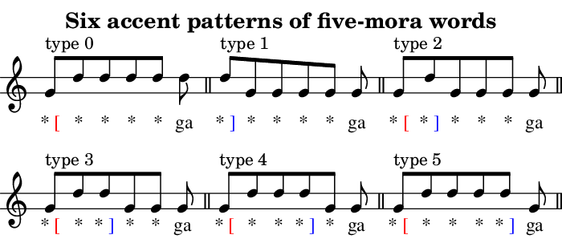
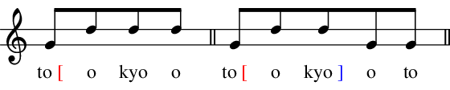
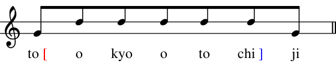
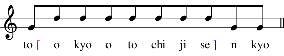
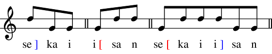
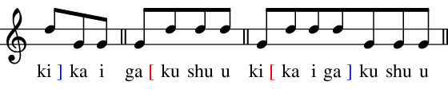
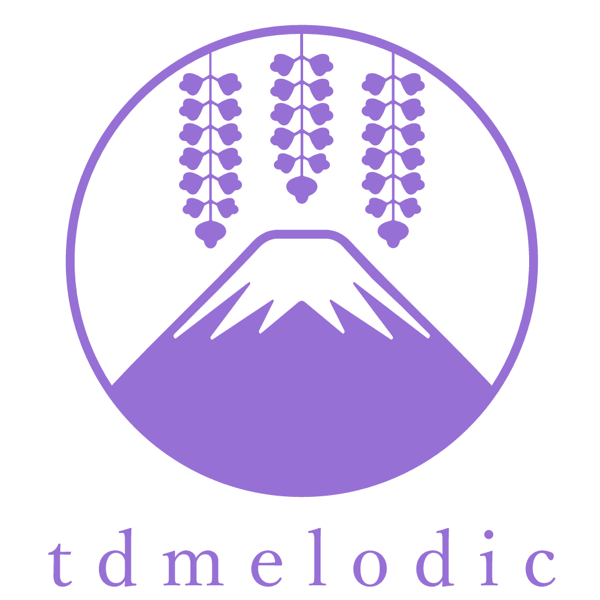

==========
Background
==========

Japanese pitch accent
=====================

Japanese language is a pitch-accented language.
While English accents are based on the strength each syllable,
Japanese accents are based on the pitch (height) of each mora.
Accent is important in spoken Japanese language, as it is in other languages.

There are large regional differences in Japanese accents.
Of these, this module deals with the accents of the contemporary Tokyo dialect,
which is one of the most influential Japanese dialects in the country.

On the Tokyo Japanese accent
============================

Raise and lower (accent nucleus)
--------------------------------

In the contemporary Tokyo dialect, there are two kinds of events that invoke the change of pitch.

- ``[``: *raise the pitch here*
- ``]``: *lower the pitch here* (a.k.a. accent nucleus)

Not all accent patterns are possible. Usually, at most one ``]`` can appear in a word.
Also, ``[`` can appear only at the beginning.
Thus, an :math:`n`-mora word basically has one of the :math:`n+1` possible accent patterns as follows.

- ``*[****``
- ``*]****``
- ``*[*]***``
- ``*[**]**``
- ``*[***]*``
- ``*[****]``

Representation of accent nuclei by digits
-----------------------------------------

Accent patterns (accent types) are often expressed by the digits which indicate the positions of the accent nuclei.
Some accent dictionaries including UniDic use this notation.

- :math:`\text{Accent type} = 0` means that there are no accent nuclei (no fall ``]``).
- :math:`\text{Accent type} = n~(n > 0)` means that the accent nucleus appears after the :math:`n`-th mora.

Heiban, Atamadaka, Nakadaka, and Odaka types
--------------------------------------------

- :math:`\text{Accent type} = 0` also called the **Heiban** (平板; flat) type.
- :math:`\text{Accent type} = 1` also called the **Atamadaka** (頭高; head high) type.
- :math:`\text{Accent type} \in \{2, \cdots, n-1\}` also called the **Nakadaka** (中高; middle high) types.
- :math:`\text{Accent type} = n` also called the **Odaka** (尾高; tail high) type.

For examples,

- 0 (Heiban)
    -  野球 ``ya[kyuu``, パソコン ``pa[sokon``, 鉛筆 ``e[npitsu``, 緑茶 ``ryo[kucha``, りんご ``ri[ngo``, 渋谷 ``shi[buya``
- 1 (Atamadaka)
    - サッカー ``sa]Qkaa``, ジュース ``ju]usu``, 猫 ``ne]ko``, メロン ``me]ron``, 金魚 ``ki]ngyo``, 新橋 ``shi]mbashi``
- 2 ~ n-1 (Nakadaka)
    - バドミントン ``ba[domi]nton``, 折り紙 ``o[ri]gami``, カブトムシ ``ka[buto]mushi``, 冷蔵庫 ``re[ezo]oko``, 池袋 ``i[kebu]kuro``
- n (Odaka)
    -  足 ``a[shi]``, 紙 ``ka[mi]``, 花 ``ha[na]``, 海苔 ``no[ri]``, 米 ``ko[me]``, 光 ``hi[kari]``, 犬 ``i[nu]``, 馬 ``u[ma]``

Difference between Heiban and Odaka
-----------------------------------

Although there may seem to be no difference in the pitch pattern within the words,
Heiban and Odaka types have differences in the pitch of the subsequent particles e.g. "*ga* が"
which is the NOM case marker for subjects.

- *hana ga* はなが
    - 鼻が ``ha[na-ga``: nose is
    - 花が ``ha[na]-ga``: flower is
- *hikari ga* ひかりが
    - ひかりが ``hi[kari-ga``: Shinkansen Hikari is
    - 光が ``hi[kari]-ga``: light is
- *hashi ga* はしが
    - 橋が ``ha[shi]-ga``: bridge is
    - 端が ``ha[shi-ga``: edge is
    - 箸が ``ha]shi-ga``: chopsticks are
- *ha ga* はが
    - 葉が ``ha[-ga``: leaf is
    - 歯が ``ha]-ga``: tooth is

Note that the GEN case markar "*no* の" is often unaffected by the preceding downforce.
(This law also has some exceptions.)

- *hana no* はなの
    - 鼻の ``ha[na-no``: nose\'s
    - 花の ``ha[na-no``: flower\'s
- *hikari no* ひかりの
    - ひかりの ``hi[kari-no``: Shinkansen Hikari\'s
    - 光の ``hi[kari-no``: light\'s
- *hashi no* はしの
    - 橋の ``ha[shi-no``: bridge\'s
    - 端の ``ha[shi-no``: edge\'s
    - 箸の ``ha]shi-no``: chopsticks\'
- *ha no* はの
    - 葉の ``ha[-no``: leaf\'s
    - 歯の ``ha]-no``: tooth\'s

Compounds
---------

The accents of compound words are a little complicated. For example,

- 東京 ``to[okyoo``
- 東京都 ``to[okyo]oto``

- 東京都知事 ``to[okyootochi]ji``

- 東京都知事選挙 ``to[okyootochijise]nkyo``

- 世界 ``se]kai``
- 遺産 ``i[san``
- 世界遺産 ``se[kaii]san``

- 機械 ``ki]kai``
- 学習 ``ga[kushuu``
- 機械学習 ``ki[kaiga]kushuu``

Logo of tdmelodic
-----------------

There are many pairs of words that have same sound patterns except the accentuation.
For example,

- *fuji*
    - 富士 (Mt. Fuji) is pronounced as ``fu]ji``.
    - 藤 (wisteria) is pronounced as ``fu[ji``.
- *sake*
    - 鮭 (salmon) is pronounced as ``sa]ke``.
    - 酒 (alcoholic beverage) is pronounced as ``sa[ke``
- *hashi*
    - 端 (edge, corner) is pronounced as ``ha[shi``.
    - 橋 (bridge) is pronounced as ``ha[shi]``.
    - 箸 (chopstics) is pronounced as ``ha]shi``.

As you can see, the logo is a combination of two "fuji"-s with different accent patterns.

Further reading
===============

- Wikipedia
    - `Wikipedia - Japanese pitch accent <https://en.wikipedia.org/wiki/Japanese_pitch_accent>`_
- Textbook
    - 松森, 新田, 木部, 中井, **日本語アクセント入門**, 三省堂, 2012
- Dictionary
    - `OJAD (Online Japanese Accent Dictionary) <http://www.gavo.t.u-tokyo.ac.jp/ojad/>`_
    - **NHK日本語発音アクセント新辞典**, NHK出版, 2016
    - 金田一, 秋永, **新明解日本語アクセント辞典 第2版**, 三省堂, 2014
